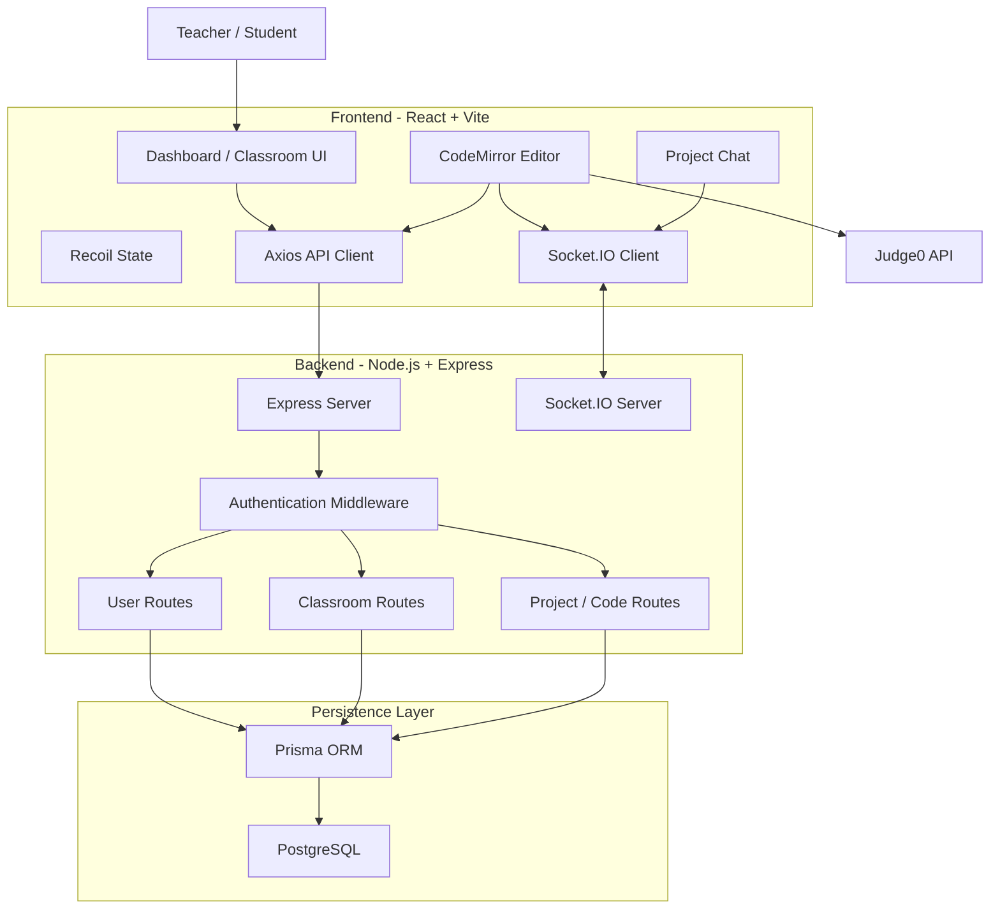

# CodeCollab

> A real-time collaborative coding platform for classrooms, pair programming, and remote coding sessions.

CodeCollab is a full-stack web application that allows teachers and students to create classrooms, manage coding projects, write and execute code, and collaborate in real time.

The platform combines a browser-based code editor with REST APIs, PostgreSQL persistence, Socket.IO real-time communication, and Judge0-based code execution.

---

# Overview

CodeCollab is designed as an online collaborative coding environment where users can work together inside shared classrooms and projects.

The application has two primary user roles:

- **Teacher**
- **Student**

Teachers can create classrooms and coding projects, while students can request access to classrooms and collaborate on projects after approval.

Once users enter the same coding project, CodeCollab establishes a real-time Socket.IO connection that allows code changes and chat messages to be synchronized between connected users.

The application also provides an integrated code execution environment powered by Judge0, supporting multiple programming languages.

---

# Key Features

## 👨‍🏫 Classroom Management

Teachers can:

- Create classrooms
- View classrooms they own
- Rename classrooms
- Delete classrooms
- View student join requests
- Approve or reject student requests

Students can:

- Browse available classrooms
- Request to join a classroom
- View classrooms they have joined

---

## 💻 Collaborative Coding

CodeCollab provides a browser-based coding environment powered by CodeMirror.

Users can:

- Write code directly in the browser
- Select a programming language
- Edit code in real time
- See other connected users
- Collaborate inside a shared project
- Save code for future sessions

Supported languages:

- JavaScript
- Python
- Java

---

## ⚡ Real-Time Code Synchronization

Socket.IO is used for real-time communication.

When a user changes code:

```text
User A
   │
   │ Code Change
   ▼
Socket.IO Server
   │
   │ Broadcast
   ▼
User B
```

The updated code is sent to other users currently connected to the same project room.

This allows multiple users to work on the same project without repeatedly refreshing the page.

---

## 👥 Live User Presence

Each project maintains a Socket.IO room.

When a user enters a project:

```text
User joins project
       ↓
Socket.IO room
       ↓
Server tracks connected users
       ↓
projectUsers event
       ↓
Frontend updates online user list
```

The editor displays the current number of connected users and their basic information.

---

## 💬 Real-Time Project Chat

Each coding project also includes a chat interface.

Users can send messages to other users connected to the same project.

The message flow is:

```text
User A
   │
   │ sendChatMessage
   ▼
Socket.IO Server
   │
   │ chatMessage
   ▼
All users in project room
```

---

## ▶️ Online Code Execution

CodeCollab integrates with Judge0 for executing code.

The user selects:

- JavaScript
- Python
- Java

and clicks **Run**.

The source code is submitted to Judge0 and the execution result is displayed inside the editor.

---

## 💾 Persistent Code Storage

Real-time synchronization and persistence are separate concerns.

### Real-time editing

Handled by:

```text
Socket.IO
```

### Permanent storage

Handled by:

```text
Express API
      ↓
Prisma
      ↓
PostgreSQL
```

When a user clicks **Save Code**, the current code is stored in the database.

This means the latest saved version can be loaded when the project is opened again.

---

# How CodeCollab Works

The application can be understood as six major layers:

```text
┌─────────────────────────────────────────────┐
│                  Frontend                   │
│        React + TypeScript + Vite            │
│                                             │
│ CodeMirror │ Dashboard │ Classroom │ Chat  │
└───────────────┬─────────────────────────────┘
                │
        ┌───────┴────────┐
        │                │
        ▼                ▼
   REST API          Socket.IO
        │                │
        └───────┬────────┘
                ▼
┌─────────────────────────────────────────────┐
│                  Backend                    │
│          Node.js + Express + TS             │
│                                             │
│ Auth │ Classes │ Projects │ Code │ Users   │
└────────────────┬────────────────────────────┘
                 │
                 ▼
          ┌──────────────┐
          │    Prisma    │
          │     ORM      │
          └──────┬───────┘
                 │
                 ▼
          ┌──────────────┐
          │ PostgreSQL   │
          │  Database    │
          └──────────────┘

Frontend ───────────────► Judge0
              Code Execution
```

---

# Application Workflow

## 1. User Registration

A user selects their role:

```text
Student
   OR
Teacher
```

The frontend sends the registration request to the Express backend.

The backend:

1. Validates the request using Zod.
2. Checks whether the email already exists.
3. Creates the user in PostgreSQL.
4. Generates a JWT.
5. Returns the authentication response.

---

## 2. User Login

The login flow is:

```text
Login Form
    ↓
React Frontend
    ↓
POST /user/signin
    ↓
Express Router
    ↓
Signin Controller
    ↓
Prisma
    ↓
PostgreSQL
    ↓
JWT generated
    ↓
Frontend stores authentication token
```

Authenticated requests send the JWT using the `Authorization` header.

---

## 3. Teacher Creates a Classroom

A teacher creates a classroom from the dashboard.

The request reaches:

```text
POST /room/class/create
```

The backend:

1. Validates the request.
2. Identifies the authenticated user.
3. Checks that the user is a teacher.
4. Creates the classroom.
5. Stores the teacher-class relationship.

---

## 4. Student Joins a Classroom

A student selects a classroom and sends a join request.

```text
Student
   ↓
Join Request
   ↓
Backend
   ↓
Request stored in PostgreSQL
   ↓
Teacher sees pending request
```

The teacher can then:

```text
APPROVE
   or
REJECT
```

If approved, the student is connected to the classroom.

---

## 5. Teacher/Student Creates a Project

A project belongs to a classroom.

The relationship is:

```text
Teacher
   │
   ▼
Classroom
   │
   ├── Project 1
   ├── Project 2
   └── Project 3
```

Projects are stored in PostgreSQL together with their owner and classroom.

---

## 6. Opening a Project

When a user opens a project:

```text
Project Page
     ↓
Load saved code from backend
     ↓
Initialize CodeMirror
     ↓
Connect to Socket.IO
     ↓
Join project room
     ↓
Start real-time collaboration
```

The frontend loads saved code using the backend API and then joins the corresponding Socket.IO room.

---

## 7. Editing Code

Suppose two users are inside the same project.

```text
                 Project Room
                     │
          ┌──────────┴──────────┐
          │                     │
       User A                 User B
          │                     │
          │ Code Change         │
          └──────────► Socket.IO
                              │
                              ▼
                         User B receives
                         updated code
```

The backend relays the update to users connected to the same project room.

---

## 8. Saving Code

Real-time changes are not automatically written to PostgreSQL on every keystroke.

When the user clicks **Save Code**:

```text
CodeMirror
    ↓
Save Code
    ↓
POST /room/project/code/save/:id
    ↓
Express
    ↓
Prisma
    ↓
PostgreSQL
```

The backend uses an upsert operation so that each project/language combination can be stored and updated.

---

## 9. Running Code

When the user clicks **Run**:

```text
CodeMirror
    ↓
Select Language
    ↓
Judge0 API
    ↓
Compile / Execute
    ↓
stdout / stderr
    ↓
Output Panel
```

The application currently supports JavaScript, Python and Java.

---

# System Architecture



---

# Real-Time Collaboration Architecture

Socket.IO is responsible for ephemeral real-time communication.

The backend creates a Socket.IO server alongside the Express HTTP server.

```text
                    Socket.IO Server
                          │
             ┌────────────┼────────────┐
             │            │            │
             ▼            ▼            ▼
        Project A     Project B    Project C
          Room          Room         Room
             │
       ┌─────┴─────┐
       │           │
     User A       User B
```

Each project uses its project ID as the room identifier.

### Important Socket Events

| Event | Purpose |
|---|---|
| `joinProjectRoom` | Join a project collaboration room |
| `leaveProjectRoom` | Leave the project room |
| `privateMessage` | Broadcast code changes |
| `projectUsers` | Update connected-user information |
| `userLeft` | Notify remaining users |
| `sendChatMessage` | Send a chat message |
| `chatMessage` | Deliver chat messages |
| `privateRoomJoin` | Join a project-specific socket room |

---

# Code Execution Architecture

Code execution is intentionally separate from the application database.

```text
┌───────────────────┐
│ CodeMirror Editor │
└─────────┬─────────┘
          │
          │ source code
          ▼
┌───────────────────┐
│    Judge0 API     │
└─────────┬─────────┘
          │
          ├── Compile
          ├── Execute
          └── Return result
                    │
                    ▼
             Output Panel
```

The frontend sends the selected language ID and source code to Judge0.

The result contains execution output such as:

- Standard output
- Standard error
- Compilation errors

---

# Authentication and Authorization

CodeCollab uses JWT-based authentication.

```text
Login
  ↓
Credentials validated
  ↓
JWT generated
  ↓
Frontend stores token
  ↓
Authorization header
  ↓
Backend authentication middleware
  ↓
JWT verified
  ↓
USERID extracted
  ↓
Protected route executed
```

The backend uses middleware to verify JWTs before allowing access to protected resources.

---

# Role-Based Access

There are two application roles:

### Teacher

Teachers can:

- Create classrooms
- Manage classrooms
- View student requests
- Approve/reject students
- Create projects
- Access projects within their classroom

### Student

Students can:

- Browse classrooms
- Request classroom access
- Access joined classrooms
- Create/manage their own projects
- Collaborate inside accessible projects

Project access also checks ownership.

```text
Is current user project owner?
        │
     Yes ─────► Allow
        │
       No
        │
Is current user a teacher?
        │
     Yes ─────► Allow
        │
       No
        │
      Locked
```

---

# Database Design

The application uses PostgreSQL with Prisma ORM.

## Entity Relationship

```mermaid
erDiagram

    USER ||--o{ CLASS : teaches
    USER }o--o{ CLASS : joins
    CLASS ||--o{ PROJECT : contains
    USER ||--o{ PROJECT : owns
    PROJECT ||--o{ CODE : contains
    CLASS ||--o{ REQUEST : receives
    USER ||--o{ REQUEST : creates
    USER ||--o{ REQUEST : handles

    USER {
        string id
        string email
        string name
        string roll
        enum type
        string password
    }

    CLASS {
        string id
        string name
        string teacherId
    }

    PROJECT {
        string id
        string name
        string userId
        string classId
    }

    CODE {
        string id
        string projectId
        enum language
        string data
    }

    REQUEST {
        string id
        string classId
        string StudentId
        string TeacherId
        enum state
    }
```

---

## Main Database Models

### User

Stores:

- User ID
- Email
- Name
- Roll number
- User type
- Password

User types:

```text
STUDENT
TEACHER
```

---

### Class

Stores classroom information:

- Classroom ID
- Classroom name
- Teacher ID

A classroom can contain:

- Multiple students
- Multiple projects
- Multiple join requests

---

### Project

A project belongs to:

```text
User
+
Class
```

This allows the application to identify both:

- Who owns the project
- Which classroom the project belongs to

---

### Code

Each project can store code for different supported languages.

The database enforces a unique combination of:

```text
projectId + language
```

This prevents multiple stored code records for the same project/language combination.

---

### Request

The Request model manages classroom join requests.

Possible states include:

```text
PENDING
REJECTED
```

When a teacher approves a request, the student is connected to the classroom.

---

# Tech Stack

## Frontend

| Technology | Purpose |
|---|---|
| React | UI development |
| TypeScript | Static typing |
| Vite | Frontend build tool |
| React Router | Client-side routing |
| Tailwind CSS | Styling |
| CodeMirror | Browser code editor |
| Recoil | State management |
| Axios | REST API communication |
| Socket.IO Client | Real-time communication |
| Radix UI | UI primitives |
| Lucide React | Icons |
| Sonner / React Hot Toast | Notifications |

The frontend dependencies include CodeMirror language packages for JavaScript, Python, Java, C++, Go, PHP and Rust, although the current application workflow exposes JavaScript, Python and Java as the primary supported execution languages. :contentReference[oaicite:8]{index=8}

---

## Backend

| Technology | Purpose |
|---|---|
| Node.js | Runtime |
| Express.js | REST API server |
| TypeScript | Backend development |
| Prisma | ORM |
| PostgreSQL | Relational database |
| Socket.IO | Real-time communication |
| JWT | Authentication |
| Zod | Request validation |
| UUID | Unique identifiers |
| CORS | Cross-origin API access |
| dotenv | Environment configuration |

The backend is compiled with TypeScript and runs from the generated `dist` directory. :contentReference[oaicite:9]{index=9}

---

## External Services

| Service | Purpose |
|---|---|
| Judge0 | Code compilation and execution |
| Neon PostgreSQL | Hosted PostgreSQL database |
| Render | Backend hosting |
| Vercel | Frontend hosting |

---

# Project Structure

```text
CodeCollab-Platform/
│
├── backend/
│   ├── prisma/
│   │   ├── migrations/
│   │   └── schema.prisma
│   │
│   ├── src/
│   │   ├── controllers/
│   │   │   └── user.ts
│   │   │
│   │   ├── middleware/
│   │   │   ├── auth.ts
│   │   │   ├── authmiddleware.ts
│   │   │   └── zodmiddleware.ts
│   │   │
│   │   ├── router/
│   │   │   ├── index.ts
│   │   │   ├── user.ts
│   │   │   └── class.ts
│   │   │
│   │   └── index.ts
│   │
│   ├── package.json
│   ├── tsconfig.json
│   └── .env
│
├── frontend/
│   ├── src/
│   │   ├── components/
│   │   │   ├── Home/
│   │   │   ├── CodeArea.tsx
│   │   │   ├── Chat.tsx
│   │   │   └── AuthProvider.tsx
│   │   │
│   │   ├── utils/
│   │   │   └── codeArena.ts
│   │   │
│   │   ├── state/
│   │   ├── types/
│   │   └── App.tsx
│   │
│   ├── package.json
│   ├── vite.config.ts
│   └── .env
│
├── .gitignore
├── ecosystem.config.cjs
└── README.md
```

-
